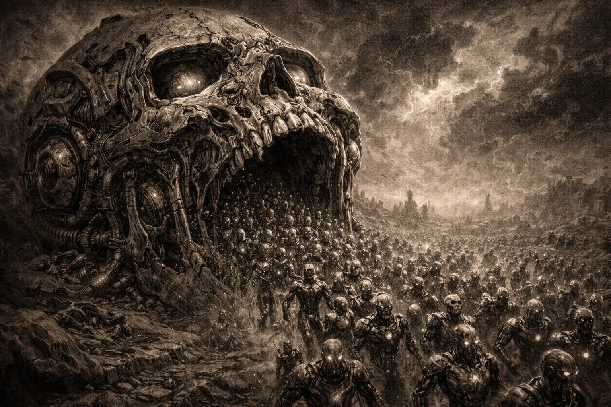

# maw - multi-agent workspaces



Tooling for coordinating multiple AI coding agents working on the same codebase.

**The problem**: When you spawn multiple AI agents to work on a codebase simultaneously, they step on each other - editing the same files, creating conflicts, losing work.

**The solution**: maw uses jj (Jujutsu) workspaces to give each agent an isolated working copy. Agents work independently without blocking each other. Conflicts are recorded in commits (not blocking) and resolved when merging.

## Install

```bash
cargo install --git https://github.com/bobisme/maw --tag v0.20.0
```

Requires [jj (Jujutsu)](https://martinvonz.github.io/jj/) to be installed.

## Quick Start

```bash
# Add maw instructions to your project's AGENTS.md
maw agents init

# Verify setup
maw doctor
```

That's it. Agents reading AGENTS.md will know how to create workspaces and coordinate.

## Commands

| Command | Description |
|---------|-------------|
| `maw ws create <name>` | Create isolated workspace for an agent |
| `maw ws list` | List all workspaces |
| `maw status` | Brief repo/workspace status summary |
| `maw ws status` | Show all agent work, conflicts, stale warnings |
| `maw ws sync` | Handle stale workspace |
| `maw ws jj <name> <args>` | Run jj in a workspace (for sandboxed agents) |
| `maw ws merge <a> <b>` | Merge named agent workspaces |
| `maw ws destroy <name>` | Remove a workspace |
| `maw init` | Initialize maw (jj + .gitignore) |
| `maw doctor` | Check system requirements |
| `maw agents init` | Add maw section to AGENTS.md |

## How It Works

Each agent gets an isolated jj workspace in `.workspaces/<name>/`. Workspaces share the repository's backing store (no disk duplication) but have separate working copies.

Agents can edit files concurrently without blocking each other. jj records conflicts in commits rather than preventing work - resolve them when merging.

```
.workspaces/
  agent-1/     # First agent's workspace
  agent-2/     # Second agent's workspace
  feature-x/   # Task-based workspace
```

## Agent Naming Conventions

Workspace names should be:
- **Lowercase alphanumeric** with hyphens or underscores (`agent-1`, `feature_auth`)
- **Short and descriptive** - either agent identity or task focus
- **Created by the coordinator** (human or orchestrating agent), not self-named

Common patterns:
- `agent-1`, `agent-2`, ... - numbered agents for parallel work
- `feature-auth`, `bugfix-123` - task-focused workspaces
- `claude-1`, `claude-2` - model-specific naming

Agents should check `maw ws list` before creating to avoid duplicates.

## Why jj?

- **Lock-free**: Multiple agents edit simultaneously, no locks
- **Instant workspaces**: Shared storage, separate working copies
- **Conflict recording**: Conflicts are recorded in commits, not blocking
- **Operation log**: Full history of what each agent did

## Configuration

Create a `.maw.toml` file in your repo root to customize behavior.

### Auto-resolve conflicts during merge

Paths like `.beads/` and `.crit/` change frequently on main while agent workspaces are active. This causes merge conflicts in files that are workspace-independent state and shouldn't block merges.

Configure patterns to auto-resolve from main during `maw ws merge`:

```toml
[merge]
# Paths matching these globs will auto-resolve from main during merge
auto_resolve_from_main = [
    ".beads/**",
    ".crit/**",
]
```

Matching files with conflicts are restored from `main`, while other conflicts still require manual resolution.

## Optional Integrations

- **[botbus](https://github.com/anthropics/botbus)**: Agent coordination and claims
- **[beads](https://github.com/Dicklesworthstone/beads_rust)**: Issue tracking
